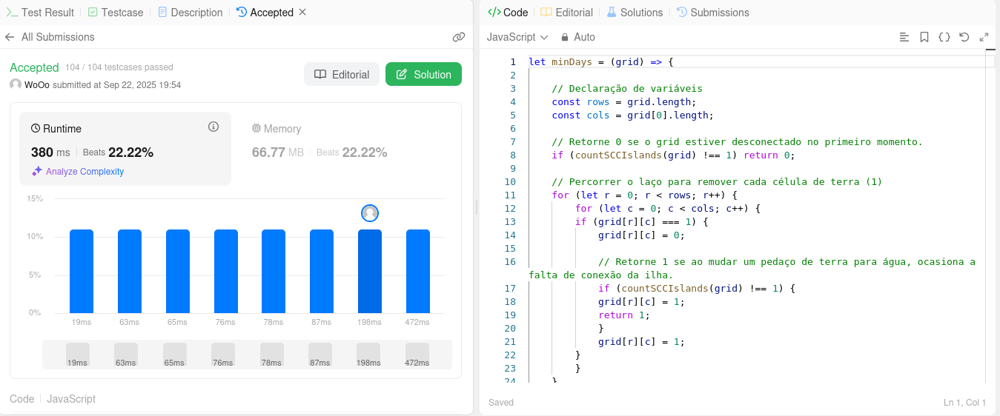

# Grafos2_LeetCode_Dupla13

**Número da Lista**: 2 
**Conteúdo da Disciplina**: Grafos 2 

## Alunos
|Matrícula | Aluno |
| -- | -- |
| 222006490  |  Vinícius de Jesus Bessa Fernandes |
| 231011865  |  Willian Wagner Xavier Ramos da Silva |

## Sobre 
[Descreva os objetivos do seu projeto e como ele funciona. ]: #
O trabalho realizado pela dupla 13 no módulo de grafos 2 consiste na resolução de quatro exercícios, sendo eles de dificuldade média ou difícil.

As seções abaixo informam a dificuldade de cada questão, linguagens utilizadas e os seus respectivos prints para confirmação da submissão.

## Exercícios
| Nome | Dificuldade |
| -- | -- |
| [1334. Find the City With the Smallest Number of Neighbors at a Threshold Distance](https://leetcode.com/problems/find-the-city-with-the-smallest-number-of-neighbors-at-a-threshold-distance/description/)  |  Média |
| [1786. nome da questão 2](https://leetcode.com/problems/---/description/)  |  Média |
| [999. nome da questão 3](https://leetcode.com/problems/---/description/)  |  Difícil |
| [1568. Minimum Number of Days to Disconnect Island](https://leetcode.com/problems/minimum-number-of-days-to-disconnect-island/description/)  |  Difícil |

## Screenshots
[Adicione 3 ou mais screenshots do projeto em funcionamento.]: #
### Exercício 999. Nome 1 (Média)

### Exercício 999. Nome 2 (Média) 

### Exercício 999. Nome 3 (Difícil) 

### Exercício 1568. Minimum Number of Days to Disconnect Island (Difícil)

## Linguagens 
[**Linguagem**: xxxxxx ]: #
[**Framework**: (caso exista)]: # 
[Descreva os pré-requisitos para rodar o seu projeto e os comandos necessários.]: #
JavaScript e Python

## Vídeo
[Explique como usar seu projeto caso haja algum passo a passo após o comando de execução.]: #

[Vídeo de explicação das soluções de cada exercício](link)
